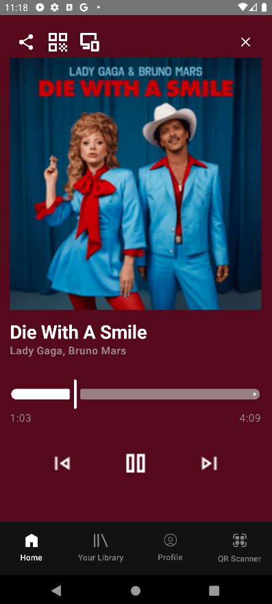
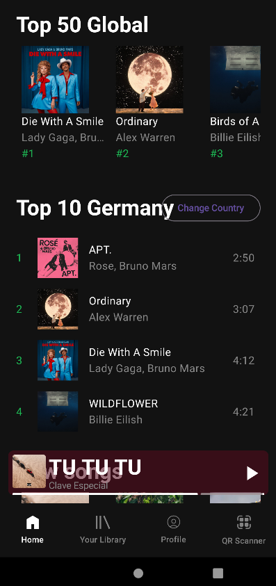
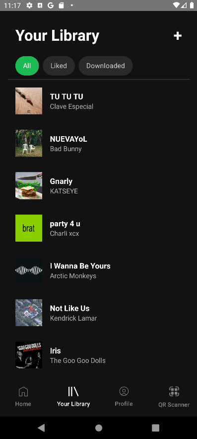
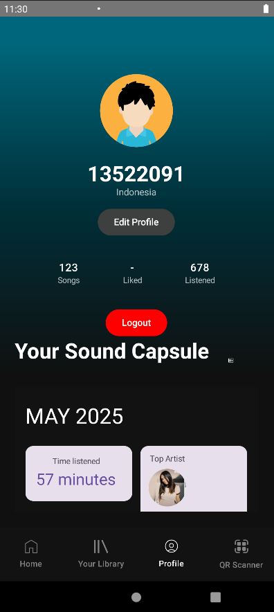
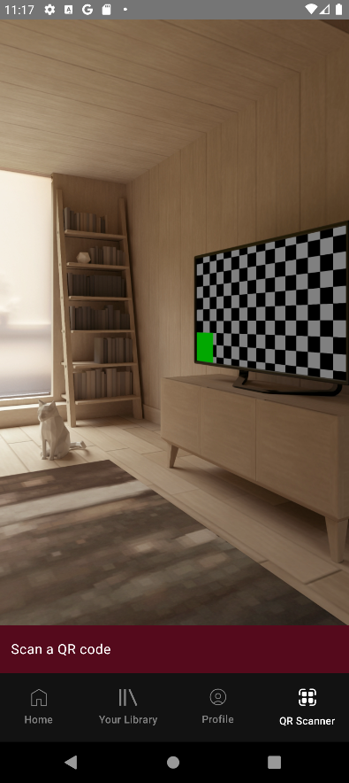
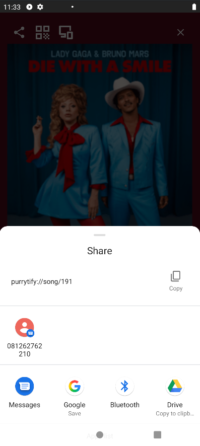
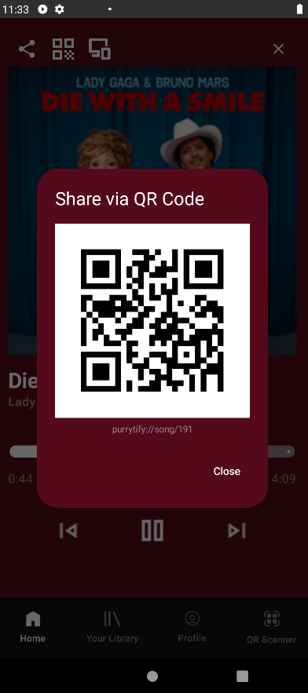

<!-- Back to Top Link-->

 

  <h1 align="center">Purritify</h1>

  

    <h3> Android Music App using Kotlin</h3>

 

  

<!-- CONTRIBUTOR -->

  <strong>
    <h3>Made By Pertamaxify:</h3>
    <table align="center">
      <tr>
        <td>NIM</td>
        <td>NAMA</td>
      </tr>
      <tr>
        <td>13522037</td>
        <td>Farhan Nafis Rayhan</td>
      </tr>
      <tr>
        <td>13522071</td>
        <td>Bagas Sambega Rosyada</td>
      </tr>
      <tr>
        <td>13522091</td>
        <td>Raden Francisco Trianto B.</td>
      </tr>
    </table>
  </strong>
   

## External Links

- [Spesification 1](https://docs.google.com/document/d/1WFKkOpWmswCLCIi4-5ptbk80FJzvuZOE/edit?tab=t.0)
- [Spesification 2](https://docs.google.com/document/d/1rN3e9GcZWstXSqVxS1h78hG6sB9qLks0dq7JwjnrIyM/edit?tab=t.0)
- [Teams](https://docs.google.com/spreadsheets/d/1B355mdQQu-cYv1FH-54gqUgATZ9_pKspCFsFTU3nAb4/edit?gid=0#gid=0)

(<a href="#readme-top">back to top</a>)

<!-- ABOUT THE PROJECT -->

## About The Project

Purritify is a music app themed around Perry the Platypus. It's an app made to explore the in's and out's of Mobile development. 
It's made in Android Studio IDE and the native kotlin language (as if in native android not the cross platform). 
The app itself is inspired by the popular Spotify mobile app. For the backend itself (Server) is not included in this project but was provided instead.

(<a href="#readme-top">back to top</a>)

<!-- GETTING STARTED -->

## Dependencies

This project is made using android studio IDE.

- Android Application Plugin
- Kotlin Android Plugin
- Kotlin Compose Plugin
- Kotlin Symbol Processing (KSP)
- Kotlin Annotation Processing (KAPT)
- Hilt (Dependency Injection Plugin and libraries)
- Jetpack Compose (UI, Material3, Tooling, Navigation)
- Coil (Image loading for Compose)
- Material Design Components
- Room (Database with Kotlin Extensions and Paging support)
- DataStore Preferences
- WorkManager (background tasks)
- AndroidX Media3 (ExoPlayer, UI, Session)
- Retrofit + Gson Converter (Networking)
- OkHttp Logging Interceptor
- Kotlin Coroutines (Core + Android)
- Play Services Location
- AndroidX Camera (core, lifecycle, view)
- Barcode Scanning
- Accompanist Permissions
- AndroidX Fragment KTX

(<a href="#readme-top">back to top</a>)

## Screenshots

### 1. Login  

### 2. Music Player   

### 3. Home  

### 4. Library  

### 5. Profile  

### 6. QR Scanner  

## Other Features (Not all features are screenshoted) 

#### Share using Link    

#### Share using QR  

(<a href="#readme-top">back to top</a>)

<!-- Task Distribution -->

## Task Distribution

|   NIM    |            Name            | Tasks                                                                              |
| :------: | :------------------------: | :--------------------------------------------------------------------------------- |
| 13522037 |    Farhan Nafis Rayhan     | Mini Player, Music Player, Liked Song, Seeding, Edit Profile, Recomendation                                     |
| 13522071 |   Bagas Sambega Rosyada    | Home, Library, Music Player, Add Song, Database, Liked Song, Sound Capsule, Online Songs, Download Online Songs, Notification Controls                        |
| 13522091 | Raden Francisco Trianto B. | Setup, Splash, Navbar, Login, Profile, Background Service, Network Sensing, Audio Routing, Share with URL, Share with QR, Responsive, Readme |

(<a href="#readme-top">back to top</a>)

<!-- ## Project Hours  -->

## Project Hours

|   NIM    |            Name            | Preperation (Hours) | Work (Hours) |
| :------: | :------------------------: | :-----------------: | :----------: |
| 13522037 |    Farhan Nafis Rayhan     |       4 hours       |      33      |
| 13522071 |   Bagas Sambega Rosyada    |       6 hours       |      42      |
| 13522091 | Raden Francisco Trianto B. |       9 hours       |      39      |

(<a href="#readme-top">back to top</a>)

